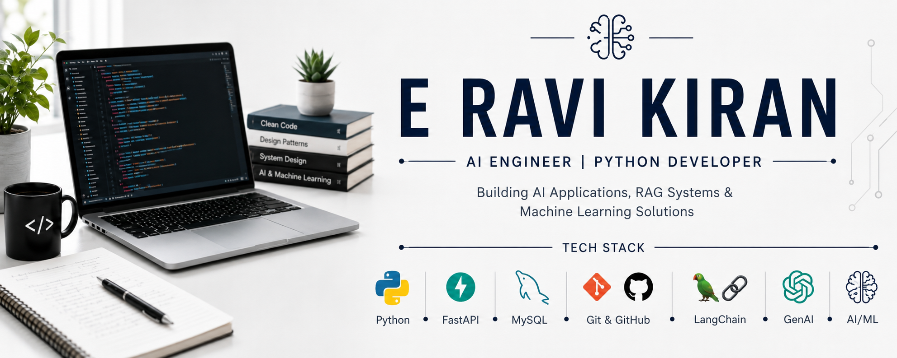

  

<h1 align="center">Hi 👋, I'm E Ravi Kiran</h1>

<h3 align="center">
AI Engineer • Python Developer • Generative AI Enthusiast
</h3>

Building AI Applications, RAG Systems, Machine Learning Solutions, and Backend APIs.

---

## 🚀 About Me

🎓 B.Tech Computer Science (Artificial Intelligence)

💡 Passionate about Artificial Intelligence, Machine Learning, FastAPI, and Generative AI

🌱 Currently Exploring

- Multi-Agent AI Systems
- Advanced LangChain Applications
- Retrieval-Augmented Generation (RAG)
- Production-Ready FastAPI Architectures
- Enterprise AI Solutions

🎯 Goal

Build scalable AI applications that solve real-world business problems.

📍 Andhra Pradesh, India

📧 Email: **ravikirangowd91@gmail.com**

🌐 Portfolio: **https://ravikiranediga-github-io.vercel.app/**

---

## 💻 Tech Stack

### Programming Languages

### Frontend Development

**Streamlit • HTML • CSS • React**

### Backend Development

**FastAPI • REST APIs • Backend Architecture**

### AI / Machine Learning

**Machine Learning • Generative AI • LangChain • RAG • Prompt Engineering**

### Databases

### Tools & Platforms

---

## 🚀 Featured Projects

### 📧 AI Email Assistant

Professional email generation platform powered by Gemini API.

**Tech Stack:** FastAPI • Streamlit • SQLite • Gemini API

🔗 Repository: https://github.com/ravikiranediga/AI_Email_Assistant

🚀 Live Demo: https://ai-email-assistant-gemini.streamlit.app/

---

### 📝 LLM Writer Critic System

Multi-agent AI workflow implementing writer and critic collaboration using Large Language Models.

**Tech Stack:** Python • LangChain • Generative AI

🔗 Repository: https://github.com/ravikiranediga/llm-writer-critic-system

---

### 📄 AI Resume Analyzer

ATS-friendly resume analysis platform using NLP techniques.

**Tech Stack:** Python • NLP • Streamlit

🔗 Repository: https://github.com/ravikiranediga/AI_BASED_RESUME_ANALYZER

---

### 📈 Sales Demand Forecasting System

Machine Learning platform for forecasting future sales demand.

**Tech Stack:** Python • Pandas • Scikit-Learn • Streamlit

🔗 Repository: https://github.com/ravikiranediga/Sales_Demand_Forecasting_System

---

### 💳 Credit Risk Fraud Detection System

Explainable AI platform for intelligent credit risk assessment.

**Tech Stack:** Python • Machine Learning • XAI

🔗 Repository: https://github.com/ravikiranediga/credit-risk-fraud-detection-xai

---

### 🤖 Enterprise Contract Risk & Compliance Auditor

AI-powered contract analysis platform using RAG and Machine Learning.

**Tech Stack:** FastAPI • LangChain • PostgreSQL • RAG

🔗 Repository: Coming Soon

---

## 🏆 Achievements

🏅 Salesforce Agentblazer Champion 2026

🏅 HackerRank Gold Badge

🏅 Built Multiple AI & Machine Learning Applications

🏅 100+ Coding Problems Solved

🏅 AI/ML Intern – Axcentra

---

## 🎯 Current Focus

🔹 Enterprise AI Applications

🔹 LangChain & Multi-Agent Systems

🔹 Retrieval-Augmented Generation (RAG)

🔹 FastAPI Backend Development

🔹 Machine Learning & Generative AI

---

## 🤝 Connect With Me

<a href="https://github.com/ravikiranediga">

---

⭐ Building AI Applications • FastAPI APIs • LangChain Solutions • Machine Learning Projects

